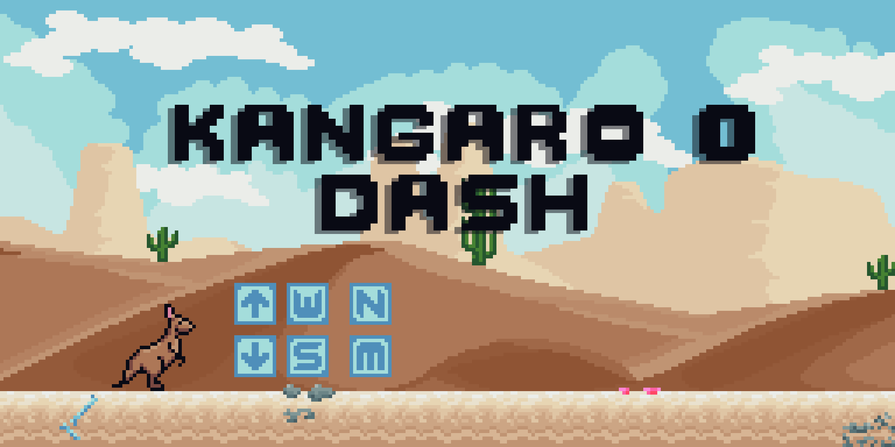

# Kangaroo-Dash

**Kangaroo Dash** is an offline game built using Python and Pygame library inspired by Google's Dino Game. In this game, the player control a pixelated kangaroo as it dashes throught the desert, jumping over cacti and ducking  under birds to avoid obstacles. The game increases in speed the longer the player stays alive. 

## Requirements:
- Python 3.x
- pygame

## How to Use:
- Run _src/main.py_